# Conversor de unidades - Challenge Oracle Next Education (ONE)

## Índice:

- [Descripción del proyecto](#descripción-del-proyecto)
- [Funcionalidades (Reto)](#funcionalidades-reto)
- [Funcionalidades (Resultado)](#funcionalidades-reto)
- [Herramientas utilizadas](#herramientas-utilizadas)
- [¿Cómo ejecutar el proyecto?](#herramientas-utilizadas)
- [Diseño](#diseño)
- [Agradecimientos](#agradecimientos)
- [Contacto](#contacto)

### Descripción del proyecto

Este proyecto es mi solución al reto de Java de la formación Oracle Next Education(ONE) de Alura Latam y Oracle, en la especialidad de desarrollo backend.

El reto consistía en usar Java para crear un conversor de dívisas con una interfaz gráfica.

### Demos:

#### Reto:

#### Resultado:

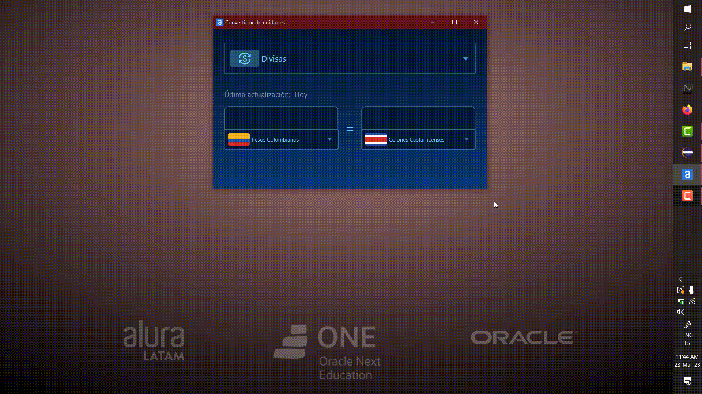

### Funcionalidades (Reto)

#### Requerimientos de Base:

La aplicación debe cumplir con los siguientes requerimientos:

- Convertir de Dólar a la moneda de tu país:
- Convertir de la moneda de tu país a Dólar.
- Convertir de la moneda de tu país a Euros.
- Convertir de la moneda de tu país a Libras Esterlinas.
- Convertir de la moneda de tu país a Yen Japonés.
- Convertir de la moneda de tu país a Won sul-coreano.

- Convertir de Dólar a la moneda de tu país
- Convertir de Euros a la moneda de tu país
- Convertir de Libras Esterlinas a la moneda de tu país
- Convertir de Yen Japonés a la moneda de tu país
- Convertir de Won sul-coreano a la moneda de tu país

#### Requerimientos Extras:

- Después de que el usuario haga clic en continuar en el programa, presente el cuadro de opciones de conversión para que pueda verificar otro valor en una moneda diferente.
- Realiza más de un programa de conversión, además de moneda, puede hacer de temperatura, kilometraje, años luz, entre otros, deja volar tu imaginación.

### Funcionalidades (Resultado)

En adición a los requerimientos propuestos, diseñé una interfaz gráfica completamente diferente y expandí las funcionalidades del convertidor. Mi solución:

- Reacciona de forma automática a las interacciones del usuario y actualiza las conversiones cada que se cambia el valor o el tipo de conversión.
- Convierte de ida y vuelta entre unidades, sin tener que cambiar la "dirección" de la conversión.
- No solo convierte entre monedas, sino también entre unidades de:
  - Longitud,
  - Masa,
  - Tiempo
  - Velocidad
  - Temperatura
  - Volumen
- Utiliza las tasas de cambio más recientes que tenga disponibles:
  - Verifica la fecha de la copia local que tiene. Si es del mismo día de la ejecución, utiliza esos valores para las conversiones, y así optimiza el tiempo de espera y los recursos necesarios para empezar a usar la aplicación.
  - Si la copia local está desactualizada o no se puede verificar su fecha, intenta recuperar las tasas de cambio más recientes, por medio de [la API Exchange Rate en línea]("https://api.exchangerate-api.com/v4/latest/COP).
  - Si obtiene los datos, utiliza esos en las conversiones y actualiza la copia local.
  - Si no hay conexión o, por algún otro motivo, no consigue los datos de la API, utiliza los de la copia local, que son los siguientes más recientes.
  - En caso de que eso también falle, utiliza los valores que vienen por defecto en el código, que datan de la fecha Marzo 20 de 2023.
  - Cuando el usuario quiera realizar conversiones de moneda, la aplicación le muestra la fecha de última actualización de las tasas de cambio en la interfaz.
- Verifica que los datos que ingresa el usuario sean válidos en formato o que tengan sentido para el tipo de conversión y muestra una notificación del error que se oculta tan pronto como se corrige el error.

### Herramientas utilizadas

Para el desarrollo, utilicé:

- [Java SDK versión 11.0.18](https://www.oracle.com/java/technologies/downloads/), como lenguaje de programación.
- [Java FX versión 17.0.6](https://openjfx.io/), para implementar la interfaz gráfica. Puedes descargarlo desde [este enlace](https://gluonhq.com/products/javafx/).
- El [paquete Org.JSON](https://github.com/stleary/JSON-java), para manejar los datos que llegaban de la API. Puedes descargar el que usé [en este enlace](https://search.maven.org/remotecontent?filepath=org/json/json/20220924/json-20220924.jar).
- [Eclipse versión 2022-12 (4.26.0)](https://www.eclipse.org/downloads/), como IDE.
- [Gluon Scene Builder versión 8.5.0](https://gluonhq.com/products/scene-builder/), para visualizar y agilizar la implementación de la interfaz gráfica.
- [Git](https://git-scm.com/) y [Github](https://github.com/), para el control de versiones.

Para el diseño, utilicé:

- [Figma], como herramienta de prototipado.
- [SVG Repo](https://www.svgrepo.com/) y el plugin [Iconify](https://www.figma.com/community/plugin/735098390272716381/Iconify) como fuentes de íconos para las imágenes de los menús desplegables.
- La página de [Alura](https://www.alura.com.br/) como inspiración y base para la tipografía, el ícono de la ventana y la paleta de colores.

Para exportar el proyecto como un .jar ejecutable utilicé:

- [IntelliJ IDEA Community Edition 2021.1.3](https://www.jetbrains.com/idea/download/), como IDE. Puedes encontrar los archivos del proyecto, listos para importar en la carpeta [intelliJ-project](/intelliJ-project/) del repositorio.
- El video-tutorial [How to setup JavaFX 11+ with IntelliJ on Windows [2022]](https://youtu.be/WDaXpDtYk3E) para configurar JavaFX en IntelliJ.
- El video-tutorial [Export JavaFX 11, 15 or 17 projects into an executable jar file with IntelliJ [2022]](https://youtu.be/F8ahBtXkQzU) para generar el ejecutable.

## ¿Cómo ejecutar el proyecto?

**NOTA:** como mínimo, necesitas tener instalado Java 11 para ejecutar el proyecto correctamente.

### Solución óptima:

1 - Descarga el archivo [unit-converter.jar](./unit-converter.jar) del repositorio.
2 - Ejecútalo.

### Solución provisional:

1 - Descarga el archivo [unit-converter.zip](./unit-converter.zip) del repositorio.
2 - Haz click derecho sobre el archivo y escoge la opción "Extraer aquí"
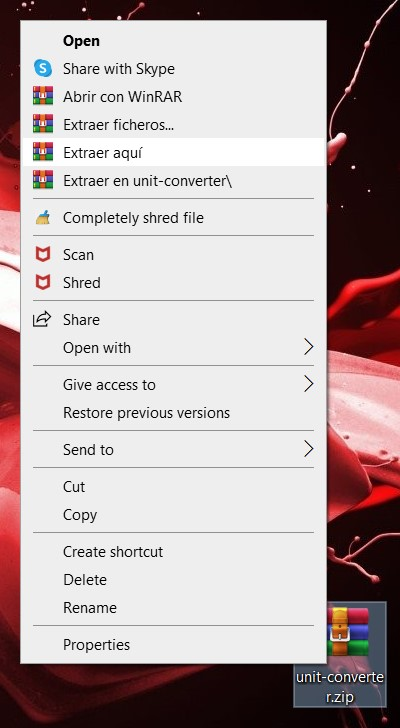
3 - Abre la carpeta `unit-converter` que se generó tras la extracción.
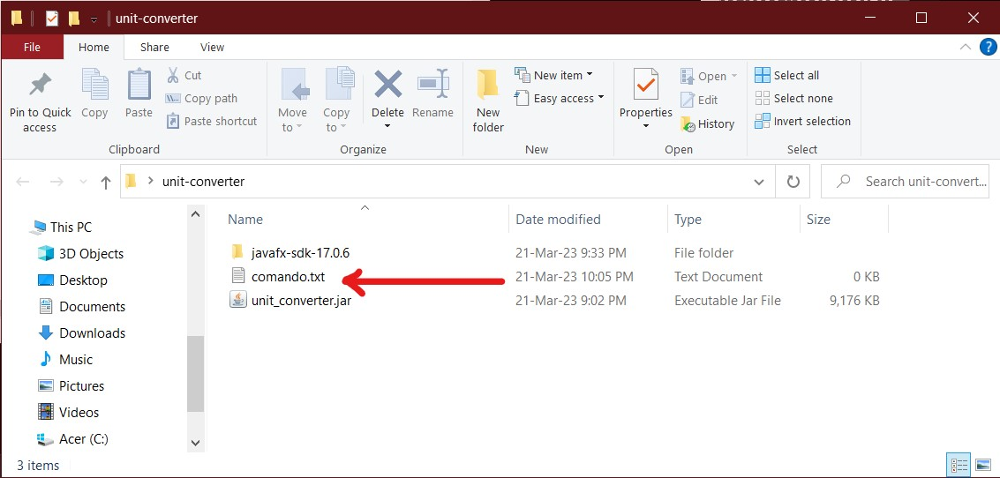
4 - Haz clic en la barra de direcciones del explorador de archivos y presiona [ Ctrl ] + [ C ] o haz click derecho y selecciona la opción de Copiar, para copiar el path a esa carpeta.
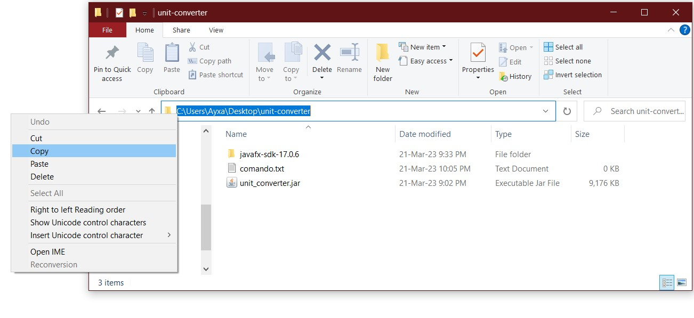
5 - Abre el archivo `comando.txt` que está en la carpeta `unit-converter`.
6 - Reemplaza `PATH` con la dirección que copiaste, seleccionándolo y presionando [ Ctrl ] + [ V ] o haciendo click derecho y escogiendo la opción Pegar.
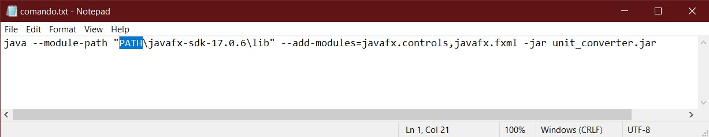
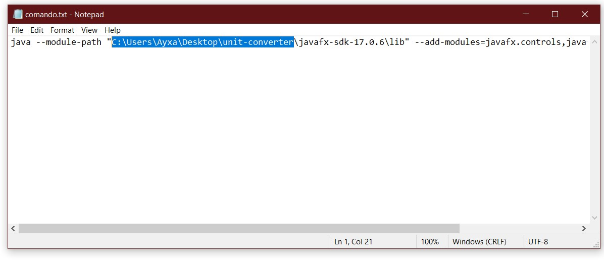
7 - Copia todo el texto en `comando.txt`, presionando [ Ctrl ] + [ A ] y luego [ Ctrl ] + [ C ] o seleccionándolo y haciendo clic derecho y escogiendo la opción Copiar.
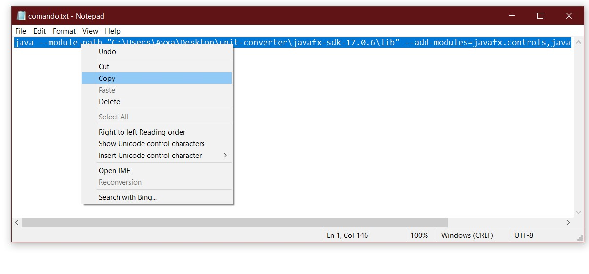
8 - Haz click en la barra de estado y reemplaza el path por `cmd` y luego presiona [ Enter ] o la tecla [ Intro ] para abrir la terminal desde la carpeta `unit-converter`.

9 - Presiona [ Ctrl ] + [ Insert ] para pegar el comando en la terminal.
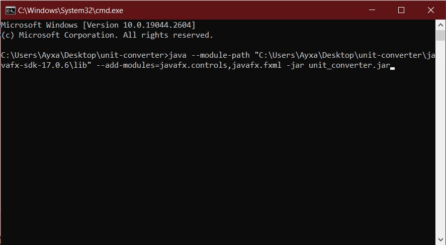
10 - Presiona la tecla [ Enter ] o [ Intro ] para ejecutar el comando, y listo, la aplicación debería ejecutarse en breve.
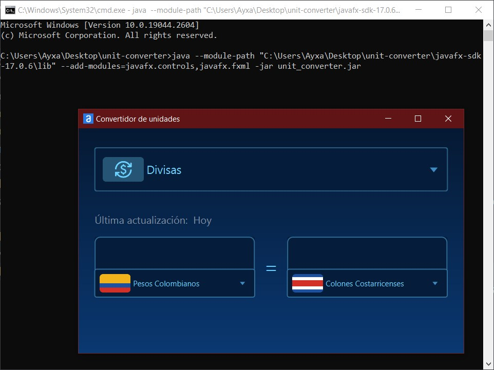

## Diseño

Puedes revisar los wireframes y prototipos que diseñé para mi aplicación en [este enlace](https://www.figma.com/file/ZhE1JBQnEJTVCvVy4mZYUv/Untitled?node-id=0%3A1&t=53GhwXhPyHDdtmfI-1).

- Antes de hacer el proceso de diseño:
  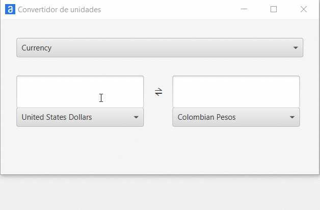

- Después el proceso de diseño:
  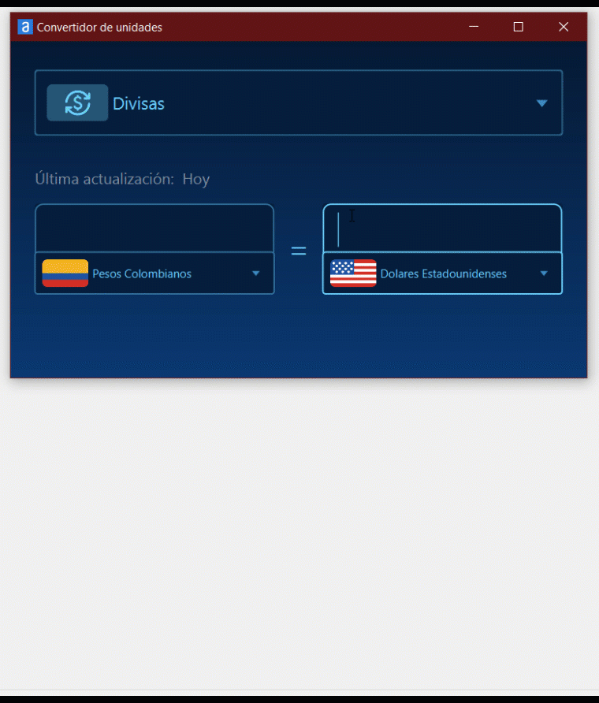

## Agradecimientos

Le agradezco de corazón a:

- [Alejandro Vásquez Cordero](https://alejandrovc6467.github.io/Portafolio/) por ayudarme a estructurar la forma de actualizar las tasas de cambio que se usarían en la aplicación, una vez que se han recuperado de la API.
- [Carlos Andrés Díaz](https://www.linkedin.com/in/andydiar/) por escuchar mis frustraciones, celebrar conmigo mis pequeños avances con este proyecto, darme ánimo para continuar en todo este proceso, y por ayudarme a escoger el diseño final de la interfaz.

## Contacto

Si quieres compartir alguna observación, comentario, consulta o sugerencia sobre el proyecto o sobre programación, no dudes en escribirme via [LinkedIn](https://www.linkedin.com/in/ayxa-chaverra-renteria/).
